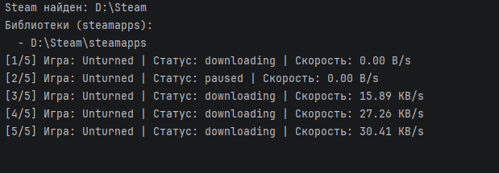

# Task 2 

Кроссплатформенный скрипт на Python для отслеживания скорости загрузок игр в  Steam в фоновом режиме.

## Функционал

- Автоматически находит установленный Steam независимо от пути установки
  - **Windows:** через реестр (registry)
  - **macOS / Linux:** через стандартные пути установки
- Определяет какая игра сейчас скачивается
- Печатает в консоль скорость загрузки раз в минуту в течение 5 минут
- Учитывает статус загрузки (downloading / paused / unknown)


## Описание работы

### 1) Поиск Steam
Скрипт определяет корневую папку Steam:

- **Windows**: читает ключи реестра  
  `HKCU\Software\Valve\Steam -> SteamPath`  
  `HKLM\Software\Valve\Steam -> InstallPath`  
  `HKLM\Software\WOW6432Node\Valve\Steam -> InstallPath`  
  Это позволяет корректно находить Steam даже при установке на другой диск.

- **macOS**: проверяет стандартный путь  
  `~/Library/Application Support/Steam`

- **Linux**: проверяет стандартные пути  
  `~/.steam/steam`, `~/.local/share/Steam` 

### 2) Поиск библиотек Steam (steamapps)
После нахождения Steam скрипт собирает список всех папок `steamapps`:

- основную: `<SteamRoot>/steamapps`
- дополнительные библиотеки из файла:  
  `<SteamRoot>/steamapps/libraryfolders.vdf`

`libraryfolders.vdf` имеет “старый” и “новый” формат (Steam менял структуру файла), поэтому парсер поддерживает оба варианта:
- старый: `"1" "D:\\SteamLibrary"`
- новый: `"1" { "path" "D:\\SteamLibrary" ... }`

### 3) Определение активной загрузки (какая игра скачивается)
Steam хранит временные данные загрузки в папке:

`steamapps/downloading/<appid>`

Скрипт ищет папки внутри `downloading` и выбирает наиболее актуальную (по времени изменения).  
`appid` затем используется для определения названия игры и расчёта скорости.


### 4) Определение названия игры
Название берётся из манифеста:

`steamapps/appmanifest_<appid>.acf`

Из файла извлекается ключ `"name"`.


### 5) Расчёт скорости загрузки
Steam не предоставляет публичного API скорости, поэтому используется практичный способ:

1. Считается общий размер папки `steamapps/downloading/<appid>` (в байтах)
2. Через минуту размер считается снова
3. Скорость вычисляется как:

`speed = (size_now - size_prev) / dt`

Скорость выводится в понятном для нас виде (KB/s, MB/s).


### 6) Определение статуса (downloading / paused)
Статус определяется по двум источникам:

1. **Логи Steam**: `<SteamRoot>/logs/content_log.txt`  
   (эвристический поиск по последним строкам: pause/download)
2. **Фактическая активность**: если размер папки загрузки не растёт и скорость ~0 несколько интервалов подряд, загрузка считается `paused`.

Второй пункт используется, поскольку формат логов может отличаться между версиями Steam, и события “pause” не всегда привязаны к appid. Поэтому “скорость ~ 0” используется как способ отслеживания паузы.


## Установка и запуск

Требуется Python 3.9+.

### Windows
```bat
python steam_script.py
```

## Пример работы

