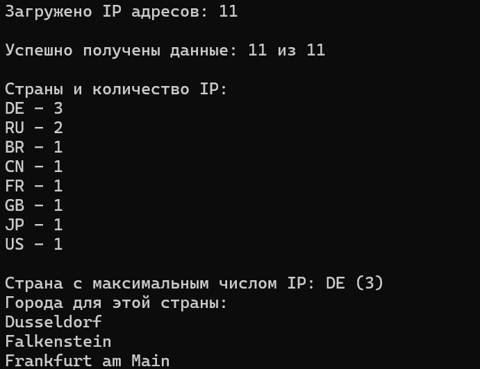

# Task 3  

Консольное приложение на C# для анализа IP-адресов с использованием публичного API `ipinfo.io`.


## Функционал

- Загружает все IP-адреса из файла `IPs.txt` в память
- Выполняет GET-запрос к `https://ipinfo.io/{ip}/json` для каждого IP
- Определяет, IP каких стран представлены в файле, и считает их количество
- Находит страну с максимальным числом IP
- Выводит список городов для этой страны


## Описание работы

### 1) Загрузка IP-адресов

Приложение читает файл 'IPs.txt', затем:

- каждая строка рассматривается как IP-адрес

- выполняется валидация через IPAddress.TryParse

- некорректные строки пропускаются, дубликаты удаляются

В результате формируется список уникальных IP-адресов в памяти.

### 2) Получение данных по IP

Для каждого IP вызывается API https://ipinfo.io/{ip}/json:

- выполняется GET-запрос через HttpClient
- десериализуется ответ с помощью Newtonsoft.Json в объект IpData с полями(IP, Country, City)

Для предотвращения превышения лимитов API используется ограничение параллельных запросов (SemaphoreSlim).

Дополнительно поддерживается переменная окружения IPINFO_TOKEN (необязательно к использованию, т.к бесплатных запросов хватает).

### 3) Анализ стран и городов

После получения данных по всем IP:
- создаётся словарь для подсчёта количества IP по странам
- определяется страна с максимальным числом IP
- формируется список городов для этой страны

### 4) Поиск страны-лидера и вывод городов

- определяется страна с максимальным числом IP
- выводится список городов для этой страны

## Установка и запуск

Требуется .NET 6.0+ и Visual Studio (или dotnet CLI).

Запуск через Visual Studio:

- Открыть проект Task_3_IPAnalytics.sln
- Убедиться, что IPs.txt имеет свойство "Copy to Output Directory" установлено в "Copy if newer"
- Запустить проект (F5 или Ctrl+F5)
- Результаты анализа будут выведены в консоль

Запуск через dotnet CLI:
- Открыть терминал в папке Task_3_IPAnalytics
- Выполнить команду:
  ```
  dotnet run
  ```

 ### Пример работы
 ]

